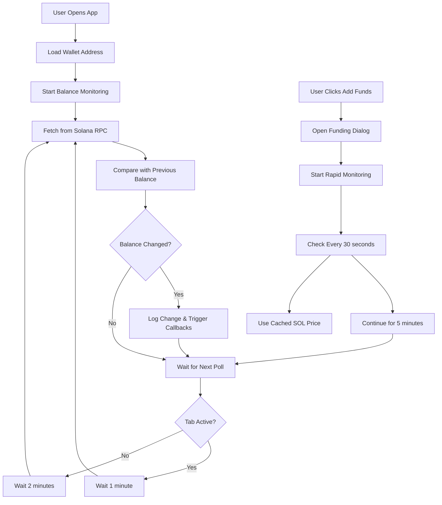

# 🚀 Real-Time Solana Balance Monitoring

This document explains the enhanced real-time balance monitoring system that fetches balances directly from the Solana blockchain using your Privy embedded wallet address.

## 🎯 Key Features

### ✅ Direct Blockchain Integration
- Fetches balance directly from Solana RPC endpoints (no third-party APIs)
- Uses your exact Privy embedded wallet public key
- Works with both Mainnet and Devnet

### ⚡ Smart Polling Strategy
- **1 minute** when tab is active (regular updates when you're watching)
- **2 minutes** when tab is inactive (preserves resources)
- **30 seconds** after funding actions (faster detection, uses cached SOL price)

### 🔄 Real-Time Change Detection
- Automatically detects balance increases (funds received)
- Logs balance changes with timestamps
- Triggers callbacks when funds arrive

### 📱 Smart Tab Management
- Automatically refreshes when you return to the tab
- Adjusts polling based on tab visibility
- Preserves battery life on mobile devices

## 🛠️ Components & Tools

### 1. Enhanced WalletBalance Component
The main wallet balance display with real-time updates:

```tsx
// Already integrated in your app
<WalletBalance className="my-wallet" />
```

**Features:**
- Shows current balance in SOL and USD
- Real-time update indicators ("just now", "5s ago")
- Manual refresh button
- "Add Funds" with rapid monitoring
- Connection status display

### 2. useBalanceMonitor Hook
Reusable hook for balance monitoring throughout your app:

```tsx
import { useBalanceMonitor } from '../hooks/useBalanceMonitor';

function MyComponent() {
  const { balance, balanceFormatted, isLoading, refresh } = useBalanceMonitor(
    walletAddress,
    {
      onFundsReceived: (change) => {
        console.log(`🎉 Received ${change.change.toFixed(4)} SOL!`);
        // Show notification, update UI, etc.
      }
    }
  );

  return (
    <div>
      <p>Balance: {balanceFormatted}</p>
      <button onClick={refresh}>Refresh</button>
    </div>
  );
}
```

### 3. Balance Test Utilities
Development tools for testing balance monitoring:

```tsx
import { testWalletBalance, simulateBalanceMonitoring } from '../utils/balanceTest';

// Test balance fetch for a specific wallet
await testWalletBalance('YOUR_WALLET_ADDRESS');

// Monitor balance changes for 60 seconds
simulateBalanceMonitoring('YOUR_WALLET_ADDRESS', 60);
```

### 4. Centralized Price Caching
Smart SOL price management to prevent rate limiting:

```tsx
import { getSolPrice, refreshSolPrice, getCurrentSolPrice } from '../utils/priceCache';

// Get SOL price (cached or fresh)
const price = await getSolPrice();

// Force refresh price (ignores cache)
const freshPrice = await refreshSolPrice();

// Get current cached price without fetching
const cachedPrice = getCurrentSolPrice(); // returns null if no cache

// Check price manager in browser console
window.solPriceManager.getCacheAge(); // returns cache age in seconds
```

## 🧪 Testing the Real-Time Features

### Method 1: Using Browser Console
Open your browser's developer console and try these commands:

```javascript
// Test balance fetch
await window.balanceMonitor.testWalletBalance('YOUR_WALLET_ADDRESS');

// Start monitoring for 2 minutes
window.balanceMonitor.simulateBalanceMonitoring('YOUR_WALLET_ADDRESS', 120);
```

### Method 2: Send Test Funds
1. Click "Add Funds" in the wallet balance component
2. Send a small amount of SOL to your wallet address
3. Watch the console logs for balance change detection
4. The balance should update within 2-5 seconds

### Method 3: Tab Visibility Test
1. Open your app in a browser tab
2. Switch to another tab for 30+ seconds
3. Return to your app tab
4. Check console - should see "Tab became active - refreshing balance"

## 🔧 Configuration Options

### Polling Intervals
You can customize polling intervals in the `useBalanceMonitor` hook:

```tsx
const monitor = useBalanceMonitor(walletAddress, {
  activeInterval: 30000,   // 30 seconds when active
  inactiveInterval: 120000, // 2 minutes when inactive
  autoStart: true,         // Start monitoring automatically
});
```

### Network Configuration
RPC endpoints are configured in `client/src/config/network.ts`:

```tsx
// Switch between mainnet and devnet
const CURRENT_NETWORK: NetworkEnvironment = 'mainnet'; // or 'devnet'
```

## 📊 Real-Time Balance Flow



## 🚨 Important Notes

### Rate Limiting Protection
- Uses multiple Helius RPC endpoints for redundancy
- Automatic fallback between endpoints
- Built-in delays to prevent rate limiting

### Error Handling
- Graceful degradation when RPC fails
- Exponential backoff for retries
- Fallback SOL price when CoinGecko is unavailable

### Performance
- **Centralized price caching** (5-minute cache for SOL price shared across app)
- **Prevents rate limiting** (no more 429 errors from CoinGecko)
- Efficient polling strategies
- Proper cleanup of intervals and timeouts

## 🎉 Expected User Experience

1. **Fast Fund Detection**: When someone sends SOL after you click "Add Funds", you'll see the update within 30-60 seconds
2. **Smart Resource Usage**: The app polls faster when you're actively using it, slower when you're not
3. **Reliable Updates**: Multiple RPC endpoints ensure consistent balance fetching
4. **Real-time Notifications**: Console logs show exactly when funds are received

## 🔍 Troubleshooting

### Balance Not Updating?
1. Check browser console for error messages
2. Verify you're on the correct network (mainnet/devnet)
3. Ensure wallet address is valid
4. Try manual refresh button

### Slow Updates?
1. Check if tab is active (faster polling when active)
2. Verify network connection
3. Look for rate limiting messages in console

### RPC Errors?
1. Multiple endpoints provide redundancy
2. Check network configuration
3. Rate limiting is automatically handled

The system is designed to be robust and provide the most responsive balance updates possible while respecting API rate limits and preserving device resources. 